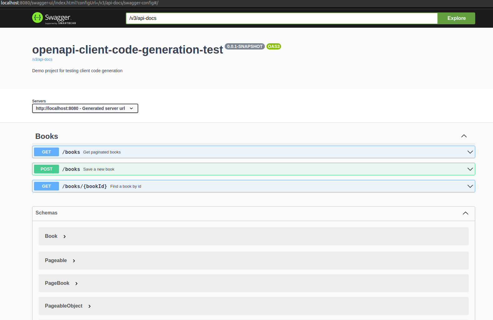
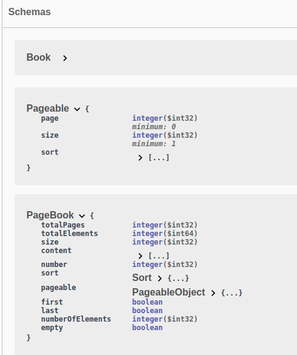
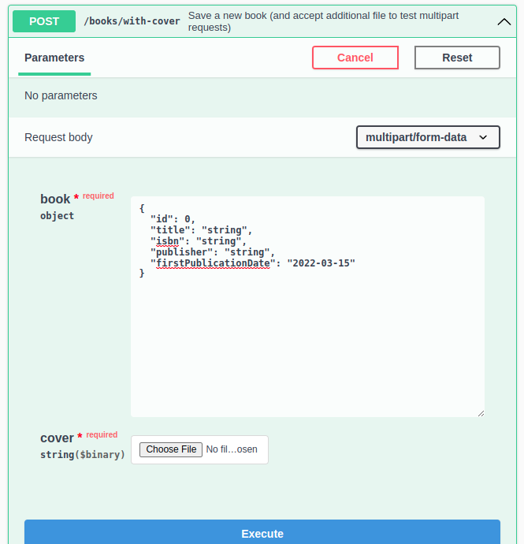

# openapi-client-code-generation-test

[](https://keepgrowing.in/)

This is a demo project to test how [springdoc-openapi](https://github.com/springdoc/springdoc-openapi) and 
[openapi-generator-maven](https://openapi-generator.tech/docs/plugins#maven) plugins work in an example Spring Boot project.


- [Prerequisites](#prerequisites)
- [Getting started](#getting-started)
- [Profiles summary](#profiles-summary)
  * [Maven profiles](#maven-profiles)
  * [Spring profiles](#spring-profiles)
- [API documentation](#api-documentation)
  * [Swagger](#swagger)
  * [OpenAPI](#openapi)
- [Client code generation](#client-code-generation)
  * [Compatibility](#compatibility)
  * [Generating code](#generating-code)
- [Additional features](#additional-features)

## Prerequisites

* JDK 13+
* [Maven](https://maven.apache.org/) (or you can use `mvnw` provided in the project)

## Getting started

First, [clone](https://docs.github.com/en/github/creating-cloning-and-archiving-repositories/cloning-a-repository-from-github/cloning-a-repository) this repository.

Then, build it locally with:
```bash
mvn clean install
```

Finally, you can run the application with:

```bash
mvn spring-boot:run
```

## Profiles summary

Below you'll find a short summary of the available profiles.

### Maven profiles

* `angular` - for [generating client code](https://codesoapbox.dev/generate-client-code-from-spring-boot-using-maven/)

### Spring profiles

* `angular` - applied automatically when the `angular` Maven profile is enabled, required for setting up a proper host for the app during code generation

## API documentation

First, build and run the application. Then you'll be able to reach the API docs.

### Swagger

The Swagger UI page: [http://localhost:8080/swagger-ui.html](http://localhost:8080/swagger-ui.html):



### OpenAPI

The OpenAPI description in json format is available at the following url: [http://localhost:8080/v3/api-docs](http://localhost:8080/v3/api-docs). 
The API specification is also available in the `yaml` format under the http://localhost:8080/v3/api-docs.yaml link.

## Client code generation

### Compatibility

`openapi-generator` v5.4.0 supports Angular 13.0.0.

### Generating code

To run client code generation using the `openapi-generator-maven-plugin` execute the following command:

```shell
mvn clean verify -Pangular -DskipTests
```

The application will be started so that the API specification can be obtained from the open api endpoint.
The generated code is available in the `/target/generated-sources/angular` directory.
Don't edit files in this directory manually.

## Additional features

Additionally, this project demonstrates example implementations for the following features:

* [Pageable support](https://keepgrowing.in/java/springboot/add-pagination-to-a-spring-boot-app/)



* [Multipart request](https://github.com/swagger-api/swagger-ui/issues/6462#issuecomment-929189296)
  


---

**Built With**

* [Spring Boot v2.5+](https://spring.io/projects/spring-boot)
* [Maven](https://maven.apache.org/)
* [springdoc-openapi](https://springdoc.org/)
* [OpenAPI Generator maven plugin](https://mvnrepository.com/artifact/org.openapitools/openapi-generator-maven-plugin)
* [Dummy4j](https://daniel-frak.github.io/dummy4j/)

<small><i><a href='http://ecotrust-canada.github.io/markdown-toc/'>Table of contents generated with markdown-toc</a></i></small>
